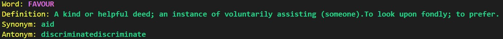

# Lexical-Cli

[](https://www.npmjs.com/package/lexical-cli)


How do you search for the meaning or synonyms or antonyms of any word?
Google or maybe use a dictionary, Right? Now, what if you can do the same in your CLI?
Yeah, Lexical-Cli makes this possible.

Using Lexical CLI you can find meaning of any word in your cli itself. Lexical-Cli uses an open-source API to fetch the data, It is a react-ink based project.

Have a look at the demo and usage below -

## Demo



## Steps to contribute in this repository

    1. Fork this repo
    2. Create a new folder/directory for your projects
    3. Add useful code for the open-source community
    4. Make pull request
    5. Now, it time for review (Don't worry, our team we will review your Pull Request(PR) within few hours.

## Installation

Install my-project with npm

```bash
$ npm install --global lexical-cli
```

## Usage

```javascript
 	Usage
	  $ lexical-cli

	Options
		--word  <Word_To_Search>

	Examples
	  $ lexical-cli --word oblivion

	  Word : OBLIVION
	  Definition: The state of forgetting completely, of being oblivious, unconscious, unaware, as when sleeping, drunk, or dead.To consign to oblivion; to efface utterly.
	  Synonym: forgetness
	  Antonym: resurrection
```

## Authors

<table>
<tr>
    <td align="center" style="word-wrap: break-word; width: 200.0; height: 200.0">
        <a href=https://www.linkedin.com/in/sidlyf>
            
            <br />
            <sub style="font-size:14px"><b>Siddharth Khuntwal</b></sub>
        </a>
    </td>
</tr>
</table>

[](https://www.linkedin.com/in/sidlyf/)
[](https://twitter.com/siddlyf)
[](https://www.instagram.com/sidlyf/)
[](https://github.com/sid-khuntwal)
[](https://github.com/sid-khuntwal)
